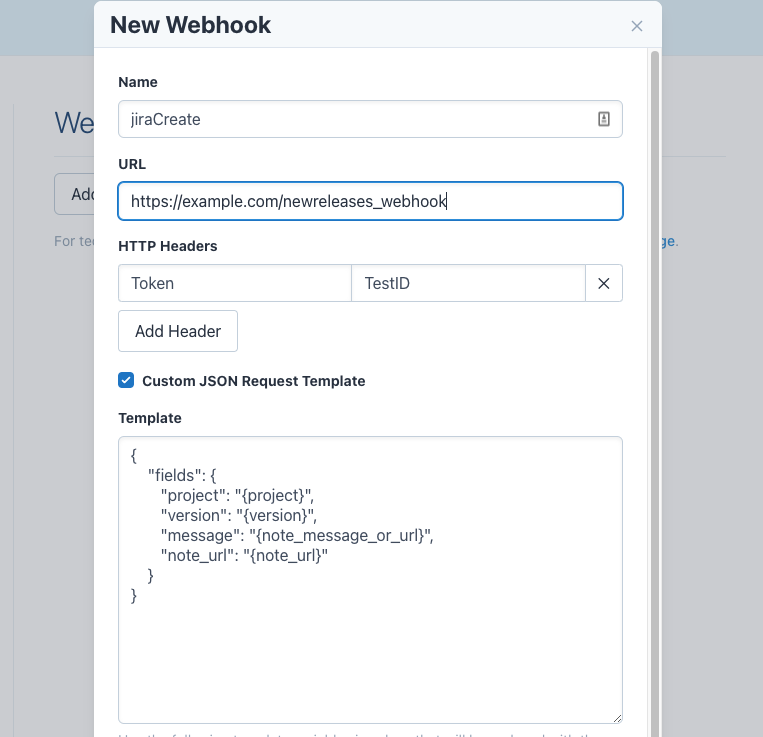

# NewRelease webhook to Jira middleware

This simple app can be setup to allow notifications from https://newreleases.io/
to produce a Jira ticket for a given project.

The provided json scheme is used within the custom webhook format, and will
ensure the webhook processor receives compatible information.



> At this time the jira integration assumes jira cloud.

### Running the app

While the application can be run natively, this repo has been created to build
and execute in a container.

``` shell
docker build -t newreleases_webhook .
```

Once built run the application

``` shell
docker run -d --env WEBHOOK_TOKEN=${TOKEN_ID} \
              --env JIRA_USER_EMAIL=${JIRA_USERNAME} \
              --env JIRA_API_TOKEN=${JIRA_TOKEN} \
              --env JIRA_PROJECT=${JIRA_PROJECT} \
              --net=host \
              webhook
```

The application will listen on port `5000` and require a **Token** header to access.

``` shell
curl -H "Token: ${TOKEN_ID}" \
     -H "Content-Type: application/json" \
     -X POST -d '{"project": "testProject", "version": 1, "note_message_or_url": "https://things.stuff", "note_url": "things"}' \
     localhost:5000/newreleases_webhook
```
